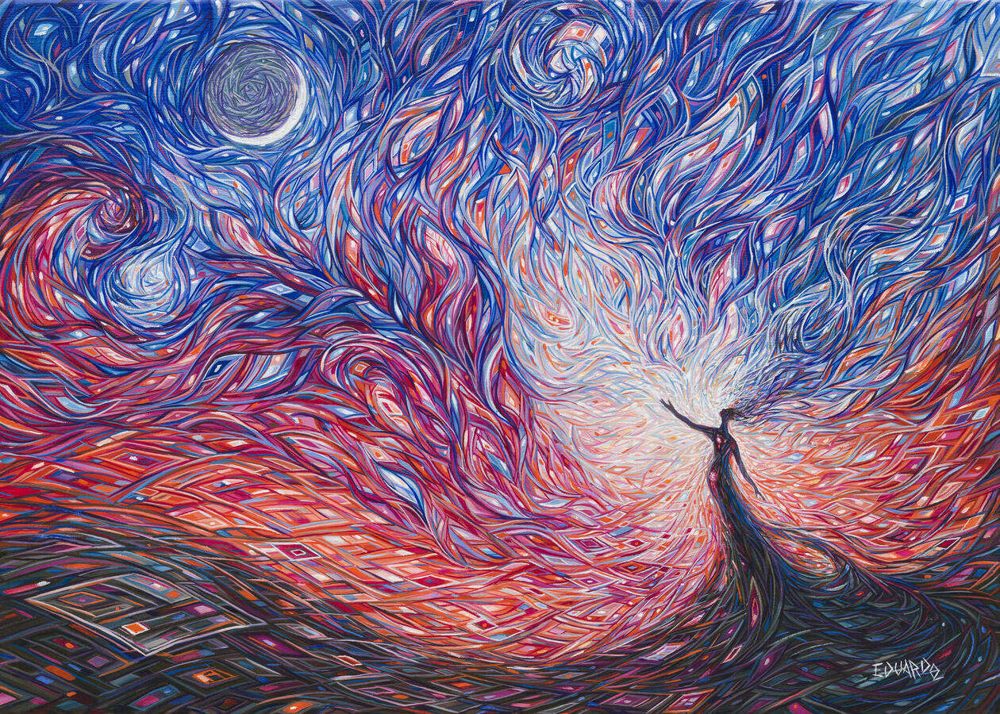
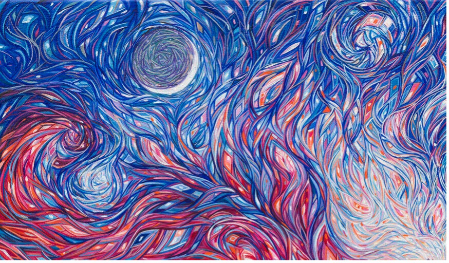
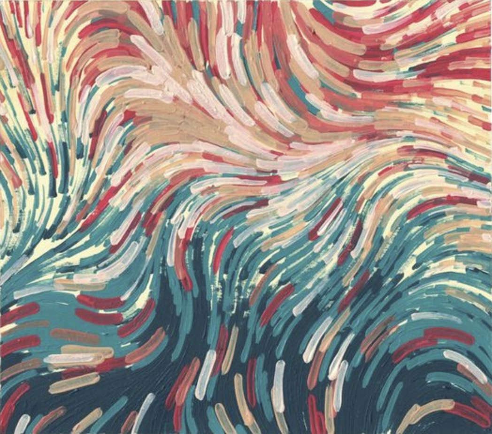
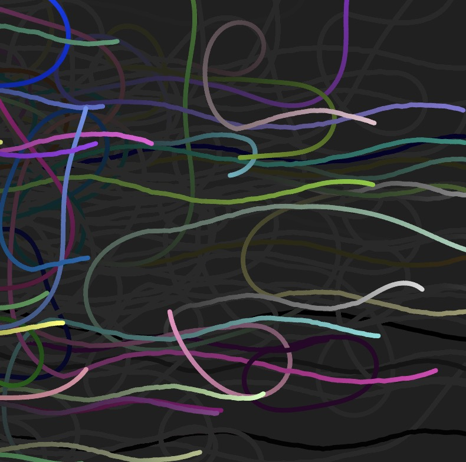

# xiji0211_9103_tut2

This is a repo that I will use to learn github.

Quiz 8

## 9103_week8_quiz

1. Imaging technique inspiration

   My **imaging technique inspiration** is an **artwork**, *Child of the Moon* by Eduardo Rodriguez Calzado.  

   This painting is characterized clearly by the intersection of lines to create geometric shapes and patterns. And the **imaging technique** that I intend to use is **using multiple lines with different colors, positions, curvature, and thickness to generate shapes, patterns, and even a painting**. I selected this imaging technique because lines are artistic and can be animated to make them flow. In the final project description, it is necessary to combine mouse or keyboard inputs to create animations. Consequently, interactivity and animation will be added to the lines and shapes so that they can interact, move, and change.

   
   *Child of the Moon* by Eduardo Rodriguez Calzado

   

   

2. Coding technique

   The **coding technique** I will use is **Loopers**, which can assist in realizing interactive and animated lines. Loopers will be used to create multiple line objects. Locations, movement trajectories, colors, and other attributes of line objects will be defined according to the image so that the converging lines may form desired patterns. The positions and angles of these lines should be updated at different frames to achieve dynamic and animated effects. And mouse event functions will be added to realize the interactive effect. For example, when click the mouse, the speed of the line movement changes.

   
 
   [Coding technique example link](https://happycoding.io/tutorials/p5js/creating-classes/loopers)